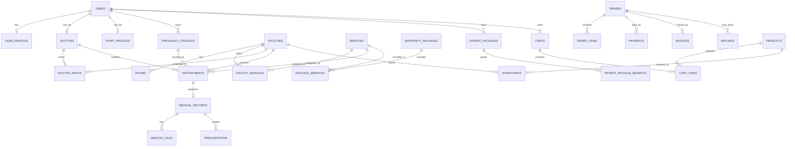

# Database Design - Maternity Care System

Thiết kế này dùng cho MariaDB + TypeORM, bám theo schema hiện có: `users`, `roles`, `permissions`, `user_roles`, `role_permissions`, `refresh_tokens`, `settings`.

## Quy ước chung

- PK: `bigint unsigned auto_increment`.
- FK: đặt theo dạng `{entity}_id`.
- Audit columns: `created_at`, `updated_at`, tùy bảng thêm `deleted_at`.
- Status nên dùng `varchar(30)` thay vì `tinyint` cho các nghiệp vụ phức tạp để dễ đọc và mở rộng.
- Tiền tệ dùng `decimal(15,2)`.
- Nội dung động, snapshot thanh toán, chỉ số sức khỏe có thể dùng `json`.

## Mục đích từng bảng

### Tài khoản và phân quyền

- `users`: bảng tài khoản đăng nhập chính của toàn hệ thống. Thai phụ, bác sĩ, staff, admin đều có một record ở đây. Bảng này chỉ nên giữ thông tin đăng nhập và định danh cơ bản như email, password hash, tên, trạng thái.
- `roles`: nhóm quyền như `system_admin`, `facility_admin`, `doctor`, `staff`, `patient`. Dùng để gom permission theo vai trò nghiệp vụ.
- `permissions`: danh sách quyền chi tiết như tạo cơ sở, cập nhật bác sĩ, xem lịch khám, xuất báo cáo. Dùng cho guard kiểm soát API.
- `user_roles`: bảng nối nhiều-nhiều giữa user và role. Một user có thể có nhiều vai trò, ví dụ vừa là bác sĩ vừa là quản lý cơ sở.
- `role_permissions`: bảng nối nhiều-nhiều giữa role và permission. Dùng để cấu hình role nào được phép gọi chức năng nào.
- `refresh_tokens`: lưu refresh token hoặc token session đã phát hành. Dùng cho đăng nhập, refresh access token, logout và revoke session.
- `user_profiles`: hồ sơ cá nhân mở rộng của user. Tách khỏi `users` để bảng đăng nhập không phình to vì các thông tin như địa chỉ, liên hệ khẩn cấp, metadata.
- `doctors`: hồ sơ chuyên môn của bác sĩ. Chỉ user có role bác sĩ mới cần record này. Dùng cho lọc bác sĩ, gán bác sĩ vào cơ sở, tạo ca trực và hiển thị hồ sơ khám.
- `staff_profiles`: hồ sơ nhân sự vận hành như lễ tân, điều phối, kế toán cơ sở. Dùng cho quản lý tài khoản nhân sự và gán staff vào cơ sở.

### Cơ sở khám và lịch làm việc

- `facilities`: danh sách cơ sở/phòng khám/chi nhánh. Đây là bảng trung tâm cho các chức năng chọn cơ sở khám, dashboard theo cơ sở, dịch vụ theo cơ sở, tồn kho theo cơ sở.
- `rooms`: phòng khám bên trong một cơ sở. Dùng để quản lý phòng siêu âm, phòng xét nghiệm, phòng khám, phòng tư vấn và phân lịch vào phòng cụ thể.
- `facility_doctors`: quan hệ bác sĩ làm việc tại cơ sở nào. Không nên lưu trực tiếp một `facility_id` trong `doctors` vì một bác sĩ có thể làm ở nhiều cơ sở.
- `facility_staff`: quan hệ staff làm việc tại cơ sở nào. Dùng để phân quyền vận hành theo chi nhánh và lọc danh sách staff của từng cơ sở.
- `doctor_shifts`: ca trực/lịch làm việc của bác sĩ theo ngày, giờ, cơ sở và phòng. Bảng này là nguồn để kiểm tra bác sĩ có khả dụng khi đặt lịch hay không.

### Dịch vụ và gói thai sản

- `services`: danh mục dịch vụ chuẩn của hệ thống, ví dụ khám thai, siêu âm, xét nghiệm, tư vấn. Đây là master data, chưa phụ thuộc cơ sở.
- `facility_services`: cấu hình dịch vụ ở từng cơ sở, gồm giá, thời lượng và trạng thái khả dụng. Dùng vì cùng một dịch vụ có thể có giá hoặc trạng thái khác nhau giữa các cơ sở.
- `maternity_packages`: danh mục gói thai sản đang bán. Bảng này lưu thông tin gói ở cấp sản phẩm như tên, giá, thời hạn, mức ưu tiên/VIP.
- `package_services`: cấu hình dịch vụ được bao gồm trong một gói, số lần sử dụng, bắt buộc hay tùy chọn. Đây là bảng quyết định quyền lợi gói.
- `package_service_facilities`: giới hạn dịch vụ trong gói được dùng ở cơ sở nào. Chỉ cần dùng khi `package_services.allowed_facility_scope = selected`.
- `patient_packages`: gói mà thai phụ đã mua/đăng ký. Đây là instance thực tế của gói theo từng khách hàng, có ngày bắt đầu, ngày hết hạn, trạng thái và lịch sử nâng cấp.
- `patient_package_benefits`: quyền lợi còn lại của một gói đã mua. Khi thai phụ sử dụng dịch vụ trong gói, bảng này được cập nhật số lần đã dùng/còn lại.
- `patient_extra_services`: dịch vụ mua thêm ngoài gói hoặc ngoài quota gói. Dùng để theo dõi thanh toán, hủy dịch vụ chưa dùng và liên kết với lịch khám.

### Hồ sơ thai sản

- `pregnancy_profiles`: hồ sơ thai kỳ của thai phụ. Một user có thể có nhiều hồ sơ theo các lần mang thai khác nhau. Dùng cho quản lý hồ sơ, tìm kiếm thai phụ, đánh dấu nguy cơ cao.
- `pregnancy_history_events`: timeline lịch sử thai kỳ. Mỗi sự kiện như tạo hồ sơ, đặt lịch, có kết quả khám, cập nhật nguy cơ sẽ được ghi lại để xem lịch sử dạng timeline.
- `health_metrics`: chỉ số sức khỏe của thai phụ và thai nhi theo thời gian. Dùng cho biểu đồ sức khỏe, cảnh báo nguy cơ và theo dõi diễn biến thai kỳ.

### Lịch khám

- `appointments`: lịch hẹn khám. Đây là bảng lõi của booking, liên kết thai phụ, hồ sơ thai kỳ, cơ sở, bác sĩ, dịch vụ, gói/dịch vụ thêm và trạng thái check-in/hoàn tất/hủy.
- `appointment_status_logs`: lịch sử đổi trạng thái của appointment. Dùng để audit ai đã xác nhận, check-in, hủy, đổi lịch hoặc xử lý không đến khám.
- `appointment_reminders`: lịch nhắc hẹn tự động. Dùng cho job gửi email/SMS/push trước giờ khám và lưu trạng thái gửi thành công/thất bại.

### Thanh toán, hóa đơn, hoàn tiền

- `orders`: đơn hàng tổng quát. Dùng chung cho mua gói, thanh toán lịch khám, thanh toán dịch vụ thêm và mua sản phẩm để hệ thống thanh toán chỉ cần xử lý một loại đơn.
- `order_items`: các dòng hàng trong order. Lưu snapshot tên, giá, số lượng tại thời điểm thanh toán để sau này đổi giá dịch vụ/gói/sản phẩm không làm sai lịch sử.
- `payments`: giao dịch thanh toán của một order. Một order có thể có nhiều payment attempt, ví dụ thanh toán online thất bại rồi thanh toán lại.
- `invoices`: hóa đơn xuất cho order. Tách riêng khỏi payment vì hóa đơn là chứng từ sau thanh toán, có số hóa đơn và file xuất PDF/điện tử.
- `refunds`: yêu cầu và xử lý hoàn tiền. Dùng cho các trường hợp hủy lịch, hủy dịch vụ thêm, hoàn tiền đơn sản phẩm hoặc hoàn một phần.

### Sản phẩm, giỏ hàng, tồn kho

- `product_categories`: danh mục sản phẩm, có thể phân cấp cha-con. Dùng cho lọc sản phẩm theo nhóm.
- `products`: danh mục sản phẩm bán cho thai phụ, ví dụ vitamin, sữa bầu, vật tư chăm sóc. Có flag `ask_doctor_before_use` để cảnh báo hỏi bác sĩ trước khi dùng.
- `carts`: giỏ hàng hiện tại của user. Tách thành bảng riêng để hỗ trợ xem giỏ hàng nhỏ, cập nhật số lượng và giữ giỏ qua nhiều phiên đăng nhập.
- `cart_items`: sản phẩm trong giỏ hàng. Dùng để thêm/xóa/cập nhật số lượng sản phẩm trước khi tạo đơn.
- `product_orders`: thông tin giao hàng bổ sung cho `orders` loại sản phẩm. Không nhét vào `orders` để các order gói/lịch khám không phải chứa cột shipping dư thừa.
- `inventories`: tồn kho sản phẩm theo cơ sở. Dùng vì mỗi cơ sở có lượng tồn khác nhau và cần cảnh báo sắp hết hàng.
- `inventory_transactions`: lịch sử biến động tồn kho. Dùng để audit nhập hàng, xuất hàng, giữ hàng cho đơn, hủy giữ hàng hoặc điều chỉnh kho.

### Kết quả khám và đơn thuốc

- `medical_records`: kết luận sau khám gắn với một appointment. Đây là record y tế chính sau buổi khám, gồm chẩn đoán, kết luận, khuyến nghị và gợi ý tái khám.
- `medical_files`: file y tế được upload như kết quả xét nghiệm, hình siêu âm, tài liệu kết quả. Tách riêng để một lần khám có nhiều file.
- `prescriptions`: đơn thuốc điện tử được bác sĩ tạo từ một medical record. Bảng này giữ trạng thái đơn thuốc và thông tin tổng quát.
- `prescription_items`: từng thuốc trong đơn, gồm liều dùng, tần suất, thời gian dùng và hướng dẫn.
- `prescription_histories`: lịch sử chỉnh sửa đơn thuốc. Cần thiết vì đơn thuốc là dữ liệu y tế, khi sửa phải lưu snapshot để audit.
- `medication_taken_logs`: log thai phụ đánh dấu đã uống thuốc. Dùng cho chức năng theo dõi uống thuốc và nhắc nhở sau này.

### Chat, chatbot và phân tuyến

- `chat_conversations`: một cuộc hội thoại giữa thai phụ với bác sĩ, staff hoặc chatbot. Có `facility_id` để phân tuyến theo cơ sở và `priority` để ưu tiên gói VIP.
- `chat_messages`: từng tin nhắn trong conversation, hỗ trợ text/file/image. Dùng để xem lịch sử chat và gửi file trong chat.

### Nội dung, FAQ, forum

- `articles`: bài viết kiến thức thai sản do admin/content tạo. Có workflow nháp, chờ duyệt, đã xuất bản, bị từ chối.
- `faqs`: câu hỏi thường gặp. Dùng cho trang FAQ và có thể làm nguồn dữ liệu đơn giản cho chatbot cơ bản.
- `forum_posts`: bài đăng forum của người dùng. Dùng cho cộng đồng hỏi đáp/chia sẻ.
- `forum_comments`: bình luận trong bài forum, có `parent_id` để hỗ trợ trả lời bình luận dạng thread.
- `content_reports`: báo cáo nội dung vi phạm. Dùng chung cho article/forum/comment/chat message để moderator xử lý.

### Cấu hình và báo cáo

- `settings`: cấu hình hệ thống dạng key-value, ví dụ thời gian nhắc lịch, chính sách hủy, thông tin thanh toán.
- Dashboard/report không cần bảng riêng ở MVP. Các thống kê doanh thu, lịch khám, dịch vụ, bác sĩ, sản phẩm bán chạy nên query từ `orders`, `payments`, `appointments`, `medical_records`, `inventories`.

## Nhóm tài khoản và nhân sự

### users

Mục đích: lưu tài khoản đăng nhập và thông tin định danh cơ bản của mọi loại người dùng trong hệ thống.

Đã có, nên mở rộng thêm:

| Column | Type | Note |
| --- | --- | --- |
| id | bigint | PK |
| name | varchar(150) | Họ tên |
| email | varchar(190) | Unique |
| password | varchar(255) | Hash |
| phone | varchar(30) | Unique nullable |
| avatar_url | varchar(500) | Nullable |
| gender | varchar(20) | Nullable |
| date_of_birth | date | Nullable |
| status | varchar(30) | `active`, `inactive`, `blocked` |
| last_login_at | timestamp | Nullable |
| created_at | timestamp |  |
| updated_at | timestamp |  |

### user_profiles

Mục đích: lưu thông tin cá nhân mở rộng của user như địa chỉ, liên hệ khẩn cấp và metadata không thuộc phần đăng nhập.

Thông tin cá nhân mở rộng cho thai phụ, staff, bác sĩ.

| Column | Type | Note |
| --- | --- | --- |
| user_id | bigint | PK, FK users |
| address | varchar(500) | Nullable |
| province | varchar(100) | Nullable |
| district | varchar(100) | Nullable |
| ward | varchar(100) | Nullable |
| emergency_contact_name | varchar(150) | Nullable |
| emergency_contact_phone | varchar(30) | Nullable |
| metadata | json | Nullable |
| created_at | timestamp |  |
| updated_at | timestamp |  |

### doctors

Mục đích: lưu hồ sơ chuyên môn của bác sĩ để phục vụ lọc bác sĩ, gán cơ sở, tạo ca trực và hiển thị khi đặt lịch.

| Column | Type | Note |
| --- | --- | --- |
| id | bigint | PK |
| user_id | bigint | FK users, unique |
| license_no | varchar(100) | Unique |
| title | varchar(100) | VD: ThS, BS.CKI |
| specialty | varchar(150) | Sản, siêu âm, xét nghiệm |
| years_of_experience | int | Default 0 |
| bio | text | Nullable |
| status | varchar(30) | `active`, `inactive` |
| created_at | timestamp |  |
| updated_at | timestamp |  |

### staff_profiles

Mục đích: lưu hồ sơ nhân sự vận hành như lễ tân, điều phối, kế toán để quản lý staff theo cơ sở.

| Column | Type | Note |
| --- | --- | --- |
| id | bigint | PK |
| user_id | bigint | FK users, unique |
| employee_code | varchar(100) | Unique |
| position | varchar(100) |  |
| status | varchar(30) | `active`, `inactive` |
| created_at | timestamp |  |
| updated_at | timestamp |  |

## Nhóm cơ sở khám

### facilities

Mục đích: lưu danh sách cơ sở khám/chi nhánh, là điểm neo cho dịch vụ, phòng khám, nhân sự, lịch khám, kho và báo cáo theo cơ sở.

| Column | Type | Note |
| --- | --- | --- |
| id | bigint | PK |
| name | varchar(200) |  |
| code | varchar(50) | Unique |
| phone | varchar(30) |  |
| email | varchar(190) | Nullable |
| address | varchar(500) |  |
| province | varchar(100) |  |
| district | varchar(100) |  |
| ward | varchar(100) |  |
| latitude | decimal(10,7) | Nullable |
| longitude | decimal(10,7) | Nullable |
| status | varchar(30) | `active`, `inactive` |
| created_at | timestamp |  |
| updated_at | timestamp |  |

### rooms

Mục đích: lưu các phòng bên trong cơ sở để phân lịch khám, siêu âm, xét nghiệm hoặc tư vấn vào đúng phòng.

| Column | Type | Note |
| --- | --- | --- |
| id | bigint | PK |
| facility_id | bigint | FK facilities |
| name | varchar(150) |  |
| room_type | varchar(50) | `exam`, `ultrasound`, `lab`, `consultation` |
| floor | varchar(50) | Nullable |
| status | varchar(30) | `active`, `inactive` |
| created_at | timestamp |  |
| updated_at | timestamp |  |

### facility_doctors

Mục đích: gán bác sĩ vào một hoặc nhiều cơ sở, hỗ trợ mô hình bác sĩ làm việc ở nhiều chi nhánh.

Gán bác sĩ vào cơ sở.

| Column | Type | Note |
| --- | --- | --- |
| facility_id | bigint | PK, FK facilities |
| doctor_id | bigint | PK, FK doctors |
| status | varchar(30) | `active`, `inactive` |
| assigned_at | timestamp |  |

### facility_staff

Mục đích: gán staff vào cơ sở để phân quyền vận hành và lọc nhân sự theo từng chi nhánh.

Gán staff vào cơ sở.

| Column | Type | Note |
| --- | --- | --- |
| facility_id | bigint | PK, FK facilities |
| staff_id | bigint | PK, FK staff_profiles |
| status | varchar(30) | `active`, `inactive` |
| assigned_at | timestamp |  |

### doctor_shifts

Mục đích: lưu ca trực/lịch làm việc của bác sĩ theo cơ sở, ngày, giờ và phòng để kiểm tra slot khi đặt lịch.

Ca trực bác sĩ.

| Column | Type | Note |
| --- | --- | --- |
| id | bigint | PK |
| doctor_id | bigint | FK doctors |
| facility_id | bigint | FK facilities |
| room_id | bigint | FK rooms, nullable |
| shift_date | date |  |
| start_time | time |  |
| end_time | time |  |
| max_appointments | int | Nullable |
| status | varchar(30) | `available`, `full`, `cancelled`, `off` |
| created_at | timestamp |  |
| updated_at | timestamp |  |

## Nhóm dịch vụ và gói thai sản

### services

Mục đích: lưu danh mục dịch vụ chuẩn của toàn hệ thống như khám thai, siêu âm, xét nghiệm, tư vấn.

| Column | Type | Note |
| --- | --- | --- |
| id | bigint | PK |
| code | varchar(50) | Unique |
| name | varchar(200) |  |
| description | text | Nullable |
| service_type | varchar(50) | `exam`, `ultrasound`, `lab`, `consultation`, `other` |
| default_duration_minutes | int |  |
| base_price | decimal(15,2) |  |
| requires_doctor_warning | boolean | Default false |
| status | varchar(30) | `active`, `inactive` |
| created_at | timestamp |  |
| updated_at | timestamp |  |

### facility_services

Mục đích: cấu hình dịch vụ theo từng cơ sở, gồm giá riêng, thời lượng riêng và trạng thái có cung cấp hay không.

Dịch vụ theo từng cơ sở, có giá và trạng thái riêng.

| Column | Type | Note |
| --- | --- | --- |
| id | bigint | PK |
| facility_id | bigint | FK facilities |
| service_id | bigint | FK services |
| price | decimal(15,2) |  |
| duration_minutes | int |  |
| status | varchar(30) | `available`, `unavailable` |
| created_at | timestamp |  |
| updated_at | timestamp |  |

Unique: `(facility_id, service_id)`.

### maternity_packages

Mục đích: lưu các gói thai sản đang bán, gồm giá, thời hạn, mô tả và mức ưu tiên/VIP.

| Column | Type | Note |
| --- | --- | --- |
| id | bigint | PK |
| code | varchar(50) | Unique |
| name | varchar(200) |  |
| description | text | Nullable |
| price | decimal(15,2) |  |
| duration_days | int | Nullable |
| priority_level | int | Default 0, VIP cao hơn |
| status | varchar(30) | `draft`, `active`, `inactive` |
| created_at | timestamp |  |
| updated_at | timestamp |  |

### package_services

Mục đích: định nghĩa quyền lợi dịch vụ trong từng gói, ví dụ dịch vụ nào được dùng, được dùng mấy lần, bắt buộc hay tùy chọn.

Cấu hình dịch vụ trong gói.

| Column | Type | Note |
| --- | --- | --- |
| id | bigint | PK |
| package_id | bigint | FK maternity_packages |
| service_id | bigint | FK services |
| included_quantity | int | Số lần dùng |
| is_required | boolean | Dịch vụ bắt buộc |
| is_optional | boolean | Dịch vụ tùy chọn |
| allowed_facility_scope | varchar(30) | `all`, `selected` |
| created_at | timestamp |  |
| updated_at | timestamp |  |

Unique: `(package_id, service_id)`.

### package_service_facilities

Mục đích: giới hạn dịch vụ trong gói chỉ được áp dụng tại một số cơ sở cụ thể.

Nếu dịch vụ trong gói chỉ áp dụng ở một số cơ sở.

| Column | Type | Note |
| --- | --- | --- |
| package_service_id | bigint | PK, FK package_services |
| facility_id | bigint | PK, FK facilities |

### patient_packages

Mục đích: lưu gói thai sản mà thai phụ đã mua/đăng ký, bao gồm trạng thái sử dụng, thời hạn và lịch sử nâng cấp.

Thai phụ đăng ký/nâng cấp gói.

| Column | Type | Note |
| --- | --- | --- |
| id | bigint | PK |
| patient_id | bigint | FK users |
| pregnancy_profile_id | bigint | FK pregnancy_profiles, nullable lúc mua trước |
| package_id | bigint | FK maternity_packages |
| start_date | date |  |
| end_date | date | Nullable |
| status | varchar(30) | `pending_payment`, `active`, `expired`, `cancelled`, `upgraded` |
| upgraded_from_id | bigint | FK patient_packages, nullable |
| created_at | timestamp |  |
| updated_at | timestamp |  |

### patient_package_benefits

Mục đích: theo dõi số lần sử dụng còn lại của từng dịch vụ trong gói đã mua của thai phụ.

Theo dõi quyền lợi còn lại trong gói.

| Column | Type | Note |
| --- | --- | --- |
| id | bigint | PK |
| patient_package_id | bigint | FK patient_packages |
| service_id | bigint | FK services |
| total_quantity | int |  |
| used_quantity | int | Default 0 |
| remaining_quantity | int |  |
| created_at | timestamp |  |
| updated_at | timestamp |  |

Unique: `(patient_package_id, service_id)`.

### patient_extra_services

Mục đích: lưu các dịch vụ thai phụ mua thêm ngoài gói hoặc ngoài quyền lợi còn lại của gói.

Dịch vụ thêm ngoài gói.

| Column | Type | Note |
| --- | --- | --- |
| id | bigint | PK |
| patient_id | bigint | FK users |
| patient_package_id | bigint | FK patient_packages, nullable |
| service_id | bigint | FK services |
| facility_id | bigint | FK facilities |
| price | decimal(15,2) | Snapshot giá |
| status | varchar(30) | `pending_payment`, `paid`, `used`, `cancelled` |
| created_at | timestamp |  |
| updated_at | timestamp |  |

## Nhóm hồ sơ thai sản

### pregnancy_profiles

Mục đích: lưu hồ sơ thai kỳ của thai phụ; một thai phụ có thể có nhiều hồ sơ tương ứng nhiều lần mang thai.

| Column | Type | Note |
| --- | --- | --- |
| id | bigint | PK |
| patient_id | bigint | FK users |
| code | varchar(50) | Unique |
| full_name | varchar(150) | Snapshot tên thai phụ |
| date_of_birth | date | Nullable |
| phone | varchar(30) | Nullable |
| last_menstrual_period | date | Nullable |
| expected_due_date | date | Nullable |
| gestational_age_weeks | int | Nullable |
| gravida | int | Số lần mang thai |
| para | int | Số lần sinh |
| risk_level | varchar(30) | `low`, `medium`, `high` |
| status | varchar(30) | `active`, `completed`, `archived` |
| notes | text | Nullable |
| created_at | timestamp |  |
| updated_at | timestamp |  |

### pregnancy_history_events

Mục đích: lưu timeline sự kiện của thai kỳ như tạo hồ sơ, khám, có kết quả, cập nhật nguy cơ hoặc ghi chú.

Lịch sử thai kỳ/timeline.

| Column | Type | Note |
| --- | --- | --- |
| id | bigint | PK |
| pregnancy_profile_id | bigint | FK pregnancy_profiles |
| event_type | varchar(50) | `profile_created`, `appointment`, `result`, `risk_updated`, `note` |
| event_date | timestamp |  |
| title | varchar(200) |  |
| description | text | Nullable |
| ref_table | varchar(100) | Nullable |
| ref_id | bigint | Nullable |
| created_by | bigint | FK users |
| created_at | timestamp |  |

### health_metrics

Mục đích: lưu các chỉ số sức khỏe của thai phụ và thai nhi theo thời gian để vẽ biểu đồ và phát hiện nguy cơ.

Chỉ số sức khỏe.

| Column | Type | Note |
| --- | --- | --- |
| id | bigint | PK |
| pregnancy_profile_id | bigint | FK pregnancy_profiles |
| recorded_by | bigint | FK users |
| recorded_at | timestamp |  |
| weight_kg | decimal(5,2) | Nullable |
| blood_pressure_systolic | int | Nullable |
| blood_pressure_diastolic | int | Nullable |
| heart_rate | int | Nullable |
| blood_sugar | decimal(6,2) | Nullable |
| fetal_heart_rate | int | Nullable |
| metadata | json | Nullable |
| notes | text | Nullable |
| created_at | timestamp |  |

## Nhóm lịch khám

### appointments

Mục đích: lưu lịch hẹn khám, liên kết thai phụ, hồ sơ thai kỳ, cơ sở, bác sĩ, dịch vụ, gói và trạng thái xử lý.

| Column | Type | Note |
| --- | --- | --- |
| id | bigint | PK |
| code | varchar(50) | Unique |
| patient_id | bigint | FK users |
| pregnancy_profile_id | bigint | FK pregnancy_profiles, nullable |
| facility_id | bigint | FK facilities |
| room_id | bigint | FK rooms, nullable |
| doctor_id | bigint | FK doctors, nullable nếu staff phân sau |
| service_id | bigint | FK services |
| patient_package_id | bigint | FK patient_packages, nullable |
| patient_extra_service_id | bigint | FK patient_extra_services, nullable |
| scheduled_start | datetime |  |
| scheduled_end | datetime |  |
| checked_in_at | timestamp | Nullable |
| status | varchar(30) | `pending_payment`, `booked`, `confirmed`, `checked_in`, `in_progress`, `completed`, `rescheduled`, `cancelled`, `no_show` |
| cancel_reason | varchar(500) | Nullable |
| no_show_handled_at | timestamp | Nullable |
| created_by | bigint | FK users |
| created_at | timestamp |  |
| updated_at | timestamp |  |

### appointment_status_logs

Mục đích: lưu lịch sử thay đổi trạng thái lịch khám để audit ai đã xác nhận, check-in, đổi lịch, hủy hoặc đánh dấu no-show.

| Column | Type | Note |
| --- | --- | --- |
| id | bigint | PK |
| appointment_id | bigint | FK appointments |
| old_status | varchar(30) | Nullable |
| new_status | varchar(30) |  |
| reason | varchar(500) | Nullable |
| changed_by | bigint | FK users |
| created_at | timestamp |  |

### appointment_reminders

Mục đích: lưu các job nhắc lịch khám tự động và trạng thái gửi nhắc hẹn qua từng kênh.

| Column | Type | Note |
| --- | --- | --- |
| id | bigint | PK |
| appointment_id | bigint | FK appointments |
| channel | varchar(30) | `email`, `sms`, `push`, `zalo` |
| scheduled_at | timestamp |  |
| sent_at | timestamp | Nullable |
| status | varchar(30) | `pending`, `sent`, `failed`, `cancelled` |
| error_message | text | Nullable |
| created_at | timestamp |  |

## Nhóm thanh toán, hóa đơn, hoàn tiền

### orders

Mục đích: lưu đơn hàng tổng quát cho mọi loại thanh toán: mua gói, lịch khám, dịch vụ thêm và sản phẩm.

Dùng chung cho mua gói, thanh toán lịch khám, dịch vụ thêm, đơn hàng sản phẩm.

| Column | Type | Note |
| --- | --- | --- |
| id | bigint | PK |
| code | varchar(50) | Unique |
| customer_id | bigint | FK users |
| facility_id | bigint | FK facilities, nullable |
| order_type | varchar(50) | `package`, `appointment`, `extra_service`, `product` |
| subtotal_amount | decimal(15,2) |  |
| discount_amount | decimal(15,2) | Default 0 |
| total_amount | decimal(15,2) |  |
| status | varchar(30) | `draft`, `pending_payment`, `paid`, `cancelled`, `refunded`, `partially_refunded` |
| created_at | timestamp |  |
| updated_at | timestamp |  |

### order_items

Mục đích: lưu các dòng hàng/dịch vụ trong đơn và snapshot tên, giá, số lượng tại thời điểm tạo đơn.

| Column | Type | Note |
| --- | --- | --- |
| id | bigint | PK |
| order_id | bigint | FK orders |
| item_type | varchar(50) | `package`, `service`, `product` |
| item_id | bigint | ID tham chiếu |
| ref_table | varchar(100) | Snapshot nguồn |
| name | varchar(200) | Snapshot tên |
| quantity | int |  |
| unit_price | decimal(15,2) |  |
| total_price | decimal(15,2) |  |
| metadata | json | Nullable |

### payments

Mục đích: lưu các lần thanh toán của đơn hàng, bao gồm phương thức, nhà cung cấp, mã giao dịch và trạng thái.

| Column | Type | Note |
| --- | --- | --- |
| id | bigint | PK |
| order_id | bigint | FK orders |
| payment_method | varchar(50) | `cash`, `bank_transfer`, `card`, `momo`, `vnpay` |
| provider | varchar(50) | Nullable |
| provider_transaction_id | varchar(190) | Nullable |
| amount | decimal(15,2) |  |
| status | varchar(30) | `pending`, `success`, `failed`, `cancelled` |
| paid_at | timestamp | Nullable |
| raw_response | json | Nullable |
| created_at | timestamp |  |
| updated_at | timestamp |  |

### invoices

Mục đích: lưu hóa đơn/chứng từ xuất cho đơn hàng sau khi thanh toán.

| Column | Type | Note |
| --- | --- | --- |
| id | bigint | PK |
| order_id | bigint | FK orders, unique |
| invoice_no | varchar(100) | Unique |
| issued_at | timestamp |  |
| buyer_name | varchar(200) |  |
| buyer_tax_code | varchar(50) | Nullable |
| file_url | varchar(500) | Nullable |
| status | varchar(30) | `issued`, `cancelled` |
| created_at | timestamp |  |

### refunds

Mục đích: lưu yêu cầu hoàn tiền và quá trình duyệt/xử lý hoàn tiền cho đơn hàng hoặc thanh toán.

| Column | Type | Note |
| --- | --- | --- |
| id | bigint | PK |
| order_id | bigint | FK orders |
| payment_id | bigint | FK payments, nullable |
| amount | decimal(15,2) |  |
| reason | varchar(500) |  |
| status | varchar(30) | `requested`, `approved`, `rejected`, `processed`, `failed` |
| requested_by | bigint | FK users |
| approved_by | bigint | FK users, nullable |
| processed_at | timestamp | Nullable |
| created_at | timestamp |  |
| updated_at | timestamp |  |

## Nhóm sản phẩm, giỏ hàng, tồn kho

### product_categories

Mục đích: lưu danh mục sản phẩm, hỗ trợ phân cấp và lọc sản phẩm theo nhóm.

| Column | Type | Note |
| --- | --- | --- |
| id | bigint | PK |
| name | varchar(150) |  |
| slug | varchar(190) | Unique |
| parent_id | bigint | FK product_categories, nullable |
| status | varchar(30) | `active`, `inactive` |
| created_at | timestamp |  |
| updated_at | timestamp |  |

### products

Mục đích: lưu sản phẩm bán cho thai phụ, gồm giá, mô tả, hình ảnh, trạng thái và cảnh báo hỏi bác sĩ trước khi dùng.

| Column | Type | Note |
| --- | --- | --- |
| id | bigint | PK |
| category_id | bigint | FK product_categories |
| sku | varchar(100) | Unique |
| name | varchar(200) |  |
| slug | varchar(190) | Unique |
| description | text | Nullable |
| price | decimal(15,2) |  |
| image_url | varchar(500) | Nullable |
| ask_doctor_before_use | boolean | Default false |
| status | varchar(30) | `active`, `inactive`, `out_of_stock` |
| created_at | timestamp |  |
| updated_at | timestamp |  |

### carts

Mục đích: lưu giỏ hàng hiện tại của người dùng trước khi tạo đơn hàng sản phẩm.

| Column | Type | Note |
| --- | --- | --- |
| id | bigint | PK |
| user_id | bigint | FK users, unique |
| created_at | timestamp |  |
| updated_at | timestamp |  |

### cart_items

Mục đích: lưu từng sản phẩm trong giỏ hàng cùng số lượng.

| Column | Type | Note |
| --- | --- | --- |
| id | bigint | PK |
| cart_id | bigint | FK carts |
| product_id | bigint | FK products |
| quantity | int |  |
| created_at | timestamp |  |
| updated_at | timestamp |  |

Unique: `(cart_id, product_id)`.

### product_orders

Mục đích: lưu thông tin giao hàng cho các order loại sản phẩm, tách khỏi `orders` để không làm rối các loại order khác.

Bổ sung thông tin giao hàng cho `orders` loại `product`.

| Column | Type | Note |
| --- | --- | --- |
| order_id | bigint | PK, FK orders |
| shipping_name | varchar(150) |  |
| shipping_phone | varchar(30) |  |
| shipping_address | varchar(500) |  |
| shipping_status | varchar(30) | `pending`, `packing`, `shipping`, `delivered`, `cancelled` |
| note | varchar(500) | Nullable |

### inventories

Mục đích: lưu số lượng tồn kho và số lượng đang giữ của từng sản phẩm tại từng cơ sở.

Tồn kho theo cơ sở.

| Column | Type | Note |
| --- | --- | --- |
| id | bigint | PK |
| facility_id | bigint | FK facilities |
| product_id | bigint | FK products |
| quantity_on_hand | int | Default 0 |
| quantity_reserved | int | Default 0 |
| low_stock_threshold | int | Default 0 |
| updated_at | timestamp |  |

Unique: `(facility_id, product_id)`.

### inventory_transactions

Mục đích: lưu lịch sử biến động tồn kho như nhập, xuất, giữ hàng, hủy giữ hàng và điều chỉnh.

| Column | Type | Note |
| --- | --- | --- |
| id | bigint | PK |
| inventory_id | bigint | FK inventories |
| transaction_type | varchar(30) | `import`, `export`, `reserve`, `release`, `adjust` |
| quantity | int | Âm/dương tùy loại |
| ref_table | varchar(100) | Nullable |
| ref_id | bigint | Nullable |
| note | varchar(500) | Nullable |
| created_by | bigint | FK users |
| created_at | timestamp |  |

## Nhóm kết quả khám và đơn thuốc

### medical_records

Mục đích: lưu kết luận sau khám của bác sĩ, gắn với lịch khám và hồ sơ thai kỳ.

Kết luận sau khám, liên kết với lịch khám.

| Column | Type | Note |
| --- | --- | --- |
| id | bigint | PK |
| appointment_id | bigint | FK appointments, unique |
| pregnancy_profile_id | bigint | FK pregnancy_profiles |
| doctor_id | bigint | FK doctors |
| diagnosis | text | Nullable |
| conclusion | text |  |
| recommendation | text | Nullable |
| next_appointment_suggested_at | datetime | Nullable |
| created_at | timestamp |  |
| updated_at | timestamp |  |

### medical_files

Mục đích: lưu file kết quả y tế như xét nghiệm, siêu âm, hình ảnh hoặc tài liệu được upload sau khám.

Upload kết quả xét nghiệm, hình siêu âm, file kết quả.

| Column | Type | Note |
| --- | --- | --- |
| id | bigint | PK |
| medical_record_id | bigint | FK medical_records |
| appointment_id | bigint | FK appointments |
| file_type | varchar(50) | `lab_result`, `ultrasound`, `image`, `document` |
| file_name | varchar(255) |  |
| file_url | varchar(500) |  |
| mime_type | varchar(100) |  |
| uploaded_by | bigint | FK users |
| created_at | timestamp |  |

### prescriptions

Mục đích: lưu đơn thuốc điện tử được tạo sau buổi khám.

| Column | Type | Note |
| --- | --- | --- |
| id | bigint | PK |
| medical_record_id | bigint | FK medical_records |
| patient_id | bigint | FK users |
| doctor_id | bigint | FK doctors |
| status | varchar(30) | `draft`, `active`, `cancelled`, `completed` |
| notes | text | Nullable |
| created_at | timestamp |  |
| updated_at | timestamp |  |

### prescription_items

Mục đích: lưu từng loại thuốc trong đơn, gồm liều dùng, tần suất, thời gian dùng và hướng dẫn.

| Column | Type | Note |
| --- | --- | --- |
| id | bigint | PK |
| prescription_id | bigint | FK prescriptions |
| medicine_name | varchar(200) |  |
| dosage | varchar(100) |  |
| frequency | varchar(100) |  |
| duration | varchar(100) |  |
| instructions | varchar(500) | Nullable |

### prescription_histories

Mục đích: lưu lịch sử thay đổi đơn thuốc kèm snapshot để audit dữ liệu y tế.

| Column | Type | Note |
| --- | --- | --- |
| id | bigint | PK |
| prescription_id | bigint | FK prescriptions |
| action | varchar(50) | `created`, `updated`, `cancelled`, `marked_taken` |
| snapshot | json |  |
| changed_by | bigint | FK users |
| created_at | timestamp |  |

### medication_taken_logs

Mục đích: lưu log thai phụ đánh dấu đã uống thuốc theo từng thuốc trong đơn.

| Column | Type | Note |
| --- | --- | --- |
| id | bigint | PK |
| prescription_item_id | bigint | FK prescription_items |
| patient_id | bigint | FK users |
| taken_at | timestamp |  |
| note | varchar(500) | Nullable |
| created_at | timestamp |  |

## Nhóm chat

### chat_conversations

Mục đích: lưu cuộc hội thoại giữa thai phụ với bác sĩ, staff hoặc chatbot, có phân tuyến theo cơ sở và ưu tiên VIP.

| Column | Type | Note |
| --- | --- | --- |
| id | bigint | PK |
| facility_id | bigint | FK facilities, nullable |
| patient_id | bigint | FK users |
| assigned_user_id | bigint | FK users, nullable: bác sĩ/staff |
| conversation_type | varchar(30) | `doctor`, `staff`, `chatbot` |
| priority | int | Gói VIP set cao hơn |
| status | varchar(30) | `open`, `pending`, `closed` |
| created_at | timestamp |  |
| updated_at | timestamp |  |

### chat_messages

Mục đích: lưu từng tin nhắn trong cuộc hội thoại, bao gồm text, file hoặc hình ảnh.

| Column | Type | Note |
| --- | --- | --- |
| id | bigint | PK |
| conversation_id | bigint | FK chat_conversations |
| sender_id | bigint | FK users, nullable nếu chatbot |
| sender_type | varchar(30) | `user`, `doctor`, `staff`, `bot`, `system` |
| message_type | varchar(30) | `text`, `file`, `image` |
| content | text | Nullable |
| file_url | varchar(500) | Nullable |
| read_at | timestamp | Nullable |
| created_at | timestamp |  |

## Nhóm content, FAQ, forum

### articles

Mục đích: lưu bài viết kiến thức thai sản và workflow duyệt/xuất bản nội dung.

| Column | Type | Note |
| --- | --- | --- |
| id | bigint | PK |
| author_id | bigint | FK users |
| title | varchar(250) |  |
| slug | varchar(250) | Unique |
| summary | varchar(500) | Nullable |
| content | longtext |  |
| status | varchar(30) | `draft`, `pending_review`, `published`, `rejected`, `archived` |
| approved_by | bigint | FK users, nullable |
| approved_at | timestamp | Nullable |
| published_at | timestamp | Nullable |
| created_at | timestamp |  |
| updated_at | timestamp |  |

### faqs

Mục đích: lưu câu hỏi thường gặp để hiển thị FAQ và có thể dùng làm dữ liệu hỗ trợ chatbot cơ bản.

| Column | Type | Note |
| --- | --- | --- |
| id | bigint | PK |
| question | varchar(500) |  |
| answer | text |  |
| category | varchar(100) | Nullable |
| status | varchar(30) | `active`, `inactive` |
| created_at | timestamp |  |
| updated_at | timestamp |  |

### forum_posts

Mục đích: lưu bài đăng forum/cộng đồng của người dùng.

| Column | Type | Note |
| --- | --- | --- |
| id | bigint | PK |
| author_id | bigint | FK users |
| title | varchar(250) |  |
| content | longtext |  |
| status | varchar(30) | `published`, `hidden`, `deleted` |
| created_at | timestamp |  |
| updated_at | timestamp |  |

### forum_comments

Mục đích: lưu bình luận trong bài forum, hỗ trợ trả lời lồng nhau qua `parent_id`.

| Column | Type | Note |
| --- | --- | --- |
| id | bigint | PK |
| post_id | bigint | FK forum_posts |
| author_id | bigint | FK users |
| parent_id | bigint | FK forum_comments, nullable |
| content | text |  |
| status | varchar(30) | `published`, `hidden`, `deleted` |
| created_at | timestamp |  |
| updated_at | timestamp |  |

### content_reports

Mục đích: lưu báo cáo nội dung vi phạm để moderator xử lý các bài viết, bình luận hoặc tin nhắn.

| Column | Type | Note |
| --- | --- | --- |
| id | bigint | PK |
| reporter_id | bigint | FK users |
| target_type | varchar(50) | `article`, `forum_post`, `forum_comment`, `chat_message` |
| target_id | bigint |  |
| reason | varchar(500) |  |
| status | varchar(30) | `pending`, `resolved`, `rejected` |
| resolved_by | bigint | FK users, nullable |
| resolved_at | timestamp | Nullable |
| created_at | timestamp |  |

## Quan hệ chính

## Index nên có

- `users(email)`, `users(phone)`, `users(status)`.
- `facilities(status, province, district)`.
- `doctors(status, specialty)`.
- `doctor_shifts(doctor_id, shift_date)`, `doctor_shifts(facility_id, shift_date)`.
- `facility_services(facility_id, status)`, `facility_services(service_id, status)`.
- `pregnancy_profiles(patient_id, status)`, `pregnancy_profiles(code)`.
- `appointments(patient_id, scheduled_start)`.
- `appointments(doctor_id, scheduled_start)`.
- `appointments(facility_id, scheduled_start, status)`.
- `orders(customer_id, created_at)`, `orders(order_type, status)`.
- `payments(order_id, status)`, `payments(provider_transaction_id)`.
- `products(category_id, status)`, `products(name)`.
- `inventories(facility_id, product_id)`.
- `medical_records(pregnancy_profile_id)`.
- `chat_conversations(patient_id, status, priority)`.
- `chat_messages(conversation_id, created_at)`.

## Gợi ý role ban đầu

- `system_admin`: quản lý toàn hệ thống, RBAC, dashboard tổng.
- `facility_admin`: quản lý cơ sở, phòng, staff, bác sĩ, dịch vụ theo cơ sở.
- `doctor`: xem lịch, khám, kết luận, đơn thuốc, chat.
- `staff`: check-in, lịch khám, thanh toán tại cơ sở, upload kết quả.
- `patient`: thai phụ, đặt lịch, mua gói, xem kết quả, chat, mua sản phẩm.
- `content_moderator`: bài viết, forum, report.

## Luồng dữ liệu quan trọng

### Đăng ký gói thai sản

1. Tạo `orders(order_type = package)`.
2. Tạo `order_items(item_type = package)`.
3. Payment thành công thì tạo `patient_packages`.
4. Copy quyền lợi từ `package_services` sang `patient_package_benefits`.

### Đặt lịch khám

1. Chọn `facility_services` còn `available`.
2. Kiểm tra `doctor_shifts` còn slot.
3. Nếu dùng gói: trừ quota ở `patient_package_benefits` khi appointment hoàn tất hoặc khi check-in, tùy rule nghiệp vụ.
4. Nếu dịch vụ lẻ/thêm: tạo `orders(order_type = appointment/extra_service)`.
5. Tạo `appointments` và log vào `appointment_status_logs`.

### Sau khám

1. Tạo `medical_records` theo `appointment_id`.
2. Upload file vào `medical_files`.
3. Nếu kê thuốc, tạo `prescriptions` và `prescription_items`.
4. Ghi timeline vào `pregnancy_history_events`.
5. Nếu cần tái khám, lưu `next_appointment_suggested_at` hoặc tạo appointment nháp.

## Bảng có thể làm phase 2

Nếu cần giảm scope MVP, có thể để sau:

- `chat_conversations`, `chat_messages`.
- `articles`, `faqs`, `forum_posts`, `forum_comments`, `content_reports`.
- `inventories`, `inventory_transactions`.
- `appointment_reminders`.
- `refunds`, `invoices`.
- Dashboard/report không cần bảng riêng lúc đầu, nên query từ `orders`, `appointments`, `payments`, `medical_records`.
