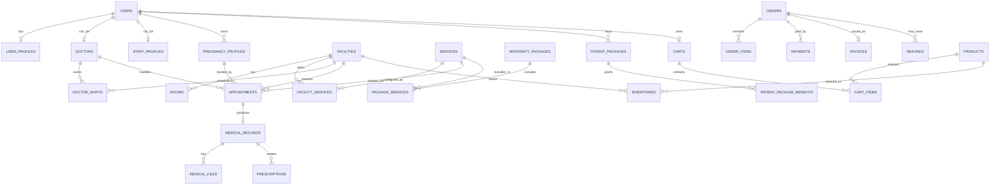

# Database Design - Maternity Care System

Thiết kế này dùng cho MariaDB + TypeORM, bám theo schema hiện có: `users`, `roles`, `permissions`, `user_roles`, `role_permissions`, `refresh_tokens`, `settings`.

## Quy ước chung

- PK: `bigint unsigned auto_increment`.
- FK: đặt theo dạng `{entity}_id`.
- Audit columns: `created_at`, `updated_at`, tùy bảng thêm `deleted_at`.
- Status nên dùng `varchar(30)` thay vì `tinyint` cho các nghiệp vụ phức tạp để dễ đọc và mở rộng.
- Tiền tệ dùng `decimal(15,2)`.
- Nội dung động, snapshot thanh toán, chỉ số sức khỏe có thể dùng `json`.

## Nhóm tài khoản và nhân sự

### users

Đã có, nên mở rộng thêm:

| Column | Type | Note |
| --- | --- | --- |
| id | bigint | PK |
| name | varchar(150) | Họ tên |
| email | varchar(190) | Unique |
| password | varchar(255) | Hash |
| phone | varchar(30) | Unique nullable |
| avatar_url | varchar(500) | Nullable |
| gender | varchar(20) | Nullable |
| date_of_birth | date | Nullable |
| status | varchar(30) | `active`, `inactive`, `blocked` |
| last_login_at | timestamp | Nullable |
| created_at | timestamp |  |
| updated_at | timestamp |  |

### user_profiles

Thông tin cá nhân mở rộng cho thai phụ, staff, bác sĩ.

| Column | Type | Note |
| --- | --- | --- |
| user_id | bigint | PK, FK users |
| address | varchar(500) | Nullable |
| province | varchar(100) | Nullable |
| district | varchar(100) | Nullable |
| ward | varchar(100) | Nullable |
| emergency_contact_name | varchar(150) | Nullable |
| emergency_contact_phone | varchar(30) | Nullable |
| metadata | json | Nullable |
| created_at | timestamp |  |
| updated_at | timestamp |  |

### doctors

| Column | Type | Note |
| --- | --- | --- |
| id | bigint | PK |
| user_id | bigint | FK users, unique |
| license_no | varchar(100) | Unique |
| title | varchar(100) | VD: ThS, BS.CKI |
| specialty | varchar(150) | Sản, siêu âm, xét nghiệm |
| years_of_experience | int | Default 0 |
| bio | text | Nullable |
| status | varchar(30) | `active`, `inactive` |
| created_at | timestamp |  |
| updated_at | timestamp |  |

### staff_profiles

| Column | Type | Note |
| --- | --- | --- |
| id | bigint | PK |
| user_id | bigint | FK users, unique |
| employee_code | varchar(100) | Unique |
| position | varchar(100) |  |
| status | varchar(30) | `active`, `inactive` |
| created_at | timestamp |  |
| updated_at | timestamp |  |

## Nhóm cơ sở khám

### facilities

| Column | Type | Note |
| --- | --- | --- |
| id | bigint | PK |
| name | varchar(200) |  |
| code | varchar(50) | Unique |
| phone | varchar(30) |  |
| email | varchar(190) | Nullable |
| address | varchar(500) |  |
| province | varchar(100) |  |
| district | varchar(100) |  |
| ward | varchar(100) |  |
| latitude | decimal(10,7) | Nullable |
| longitude | decimal(10,7) | Nullable |
| status | varchar(30) | `active`, `inactive` |
| created_at | timestamp |  |
| updated_at | timestamp |  |

### rooms

| Column | Type | Note |
| --- | --- | --- |
| id | bigint | PK |
| facility_id | bigint | FK facilities |
| name | varchar(150) |  |
| room_type | varchar(50) | `exam`, `ultrasound`, `lab`, `consultation` |
| floor | varchar(50) | Nullable |
| status | varchar(30) | `active`, `inactive` |
| created_at | timestamp |  |
| updated_at | timestamp |  |

### facility_doctors

Gán bác sĩ vào cơ sở.

| Column | Type | Note |
| --- | --- | --- |
| facility_id | bigint | PK, FK facilities |
| doctor_id | bigint | PK, FK doctors |
| status | varchar(30) | `active`, `inactive` |
| assigned_at | timestamp |  |

### facility_staff

Gán staff vào cơ sở.

| Column | Type | Note |
| --- | --- | --- |
| facility_id | bigint | PK, FK facilities |
| staff_id | bigint | PK, FK staff_profiles |
| status | varchar(30) | `active`, `inactive` |
| assigned_at | timestamp |  |

### doctor_shifts

Ca trực bác sĩ.

| Column | Type | Note |
| --- | --- | --- |
| id | bigint | PK |
| doctor_id | bigint | FK doctors |
| facility_id | bigint | FK facilities |
| room_id | bigint | FK rooms, nullable |
| shift_date | date |  |
| start_time | time |  |
| end_time | time |  |
| max_appointments | int | Nullable |
| status | varchar(30) | `available`, `full`, `cancelled`, `off` |
| created_at | timestamp |  |
| updated_at | timestamp |  |

## Nhóm dịch vụ và gói thai sản

### services

| Column | Type | Note |
| --- | --- | --- |
| id | bigint | PK |
| code | varchar(50) | Unique |
| name | varchar(200) |  |
| description | text | Nullable |
| service_type | varchar(50) | `exam`, `ultrasound`, `lab`, `consultation`, `other` |
| default_duration_minutes | int |  |
| base_price | decimal(15,2) |  |
| requires_doctor_warning | boolean | Default false |
| status | varchar(30) | `active`, `inactive` |
| created_at | timestamp |  |
| updated_at | timestamp |  |

### facility_services

Dịch vụ theo từng cơ sở, có giá và trạng thái riêng.

| Column | Type | Note |
| --- | --- | --- |
| id | bigint | PK |
| facility_id | bigint | FK facilities |
| service_id | bigint | FK services |
| price | decimal(15,2) |  |
| duration_minutes | int |  |
| status | varchar(30) | `available`, `unavailable` |
| created_at | timestamp |  |
| updated_at | timestamp |  |

Unique: `(facility_id, service_id)`.

### maternity_packages

| Column | Type | Note |
| --- | --- | --- |
| id | bigint | PK |
| code | varchar(50) | Unique |
| name | varchar(200) |  |
| description | text | Nullable |
| price | decimal(15,2) |  |
| duration_days | int | Nullable |
| priority_level | int | Default 0, VIP cao hơn |
| status | varchar(30) | `draft`, `active`, `inactive` |
| created_at | timestamp |  |
| updated_at | timestamp |  |

### package_services

Cấu hình dịch vụ trong gói.

| Column | Type | Note |
| --- | --- | --- |
| id | bigint | PK |
| package_id | bigint | FK maternity_packages |
| service_id | bigint | FK services |
| included_quantity | int | Số lần dùng |
| is_required | boolean | Dịch vụ bắt buộc |
| is_optional | boolean | Dịch vụ tùy chọn |
| allowed_facility_scope | varchar(30) | `all`, `selected` |
| created_at | timestamp |  |
| updated_at | timestamp |  |

Unique: `(package_id, service_id)`.

### package_service_facilities

Nếu dịch vụ trong gói chỉ áp dụng ở một số cơ sở.

| Column | Type | Note |
| --- | --- | --- |
| package_service_id | bigint | PK, FK package_services |
| facility_id | bigint | PK, FK facilities |

### patient_packages

Thai phụ đăng ký/nâng cấp gói.

| Column | Type | Note |
| --- | --- | --- |
| id | bigint | PK |
| patient_id | bigint | FK users |
| pregnancy_profile_id | bigint | FK pregnancy_profiles, nullable lúc mua trước |
| package_id | bigint | FK maternity_packages |
| start_date | date |  |
| end_date | date | Nullable |
| status | varchar(30) | `pending_payment`, `active`, `expired`, `cancelled`, `upgraded` |
| upgraded_from_id | bigint | FK patient_packages, nullable |
| created_at | timestamp |  |
| updated_at | timestamp |  |

### patient_package_benefits

Theo dõi quyền lợi còn lại trong gói.

| Column | Type | Note |
| --- | --- | --- |
| id | bigint | PK |
| patient_package_id | bigint | FK patient_packages |
| service_id | bigint | FK services |
| total_quantity | int |  |
| used_quantity | int | Default 0 |
| remaining_quantity | int |  |
| created_at | timestamp |  |
| updated_at | timestamp |  |

Unique: `(patient_package_id, service_id)`.

### patient_extra_services

Dịch vụ thêm ngoài gói.

| Column | Type | Note |
| --- | --- | --- |
| id | bigint | PK |
| patient_id | bigint | FK users |
| patient_package_id | bigint | FK patient_packages, nullable |
| service_id | bigint | FK services |
| facility_id | bigint | FK facilities |
| price | decimal(15,2) | Snapshot giá |
| status | varchar(30) | `pending_payment`, `paid`, `used`, `cancelled` |
| created_at | timestamp |  |
| updated_at | timestamp |  |

## Nhóm hồ sơ thai sản

### pregnancy_profiles

| Column | Type | Note |
| --- | --- | --- |
| id | bigint | PK |
| patient_id | bigint | FK users |
| code | varchar(50) | Unique |
| full_name | varchar(150) | Snapshot tên thai phụ |
| date_of_birth | date | Nullable |
| phone | varchar(30) | Nullable |
| last_menstrual_period | date | Nullable |
| expected_due_date | date | Nullable |
| gestational_age_weeks | int | Nullable |
| gravida | int | Số lần mang thai |
| para | int | Số lần sinh |
| risk_level | varchar(30) | `low`, `medium`, `high` |
| status | varchar(30) | `active`, `completed`, `archived` |
| notes | text | Nullable |
| created_at | timestamp |  |
| updated_at | timestamp |  |

### pregnancy_history_events

Lịch sử thai kỳ/timeline.

| Column | Type | Note |
| --- | --- | --- |
| id | bigint | PK |
| pregnancy_profile_id | bigint | FK pregnancy_profiles |
| event_type | varchar(50) | `profile_created`, `appointment`, `result`, `risk_updated`, `note` |
| event_date | timestamp |  |
| title | varchar(200) |  |
| description | text | Nullable |
| ref_table | varchar(100) | Nullable |
| ref_id | bigint | Nullable |
| created_by | bigint | FK users |
| created_at | timestamp |  |

### health_metrics

Chỉ số sức khỏe.

| Column | Type | Note |
| --- | --- | --- |
| id | bigint | PK |
| pregnancy_profile_id | bigint | FK pregnancy_profiles |
| recorded_by | bigint | FK users |
| recorded_at | timestamp |  |
| weight_kg | decimal(5,2) | Nullable |
| blood_pressure_systolic | int | Nullable |
| blood_pressure_diastolic | int | Nullable |
| heart_rate | int | Nullable |
| blood_sugar | decimal(6,2) | Nullable |
| fetal_heart_rate | int | Nullable |
| metadata | json | Nullable |
| notes | text | Nullable |
| created_at | timestamp |  |

## Nhóm lịch khám

### appointments

| Column | Type | Note |
| --- | --- | --- |
| id | bigint | PK |
| code | varchar(50) | Unique |
| patient_id | bigint | FK users |
| pregnancy_profile_id | bigint | FK pregnancy_profiles, nullable |
| facility_id | bigint | FK facilities |
| room_id | bigint | FK rooms, nullable |
| doctor_id | bigint | FK doctors, nullable nếu staff phân sau |
| service_id | bigint | FK services |
| patient_package_id | bigint | FK patient_packages, nullable |
| patient_extra_service_id | bigint | FK patient_extra_services, nullable |
| scheduled_start | datetime |  |
| scheduled_end | datetime |  |
| checked_in_at | timestamp | Nullable |
| status | varchar(30) | `pending_payment`, `booked`, `confirmed`, `checked_in`, `in_progress`, `completed`, `rescheduled`, `cancelled`, `no_show` |
| cancel_reason | varchar(500) | Nullable |
| no_show_handled_at | timestamp | Nullable |
| created_by | bigint | FK users |
| created_at | timestamp |  |
| updated_at | timestamp |  |

### appointment_status_logs

| Column | Type | Note |
| --- | --- | --- |
| id | bigint | PK |
| appointment_id | bigint | FK appointments |
| old_status | varchar(30) | Nullable |
| new_status | varchar(30) |  |
| reason | varchar(500) | Nullable |
| changed_by | bigint | FK users |
| created_at | timestamp |  |

### appointment_reminders

| Column | Type | Note |
| --- | --- | --- |
| id | bigint | PK |
| appointment_id | bigint | FK appointments |
| channel | varchar(30) | `email`, `sms`, `push`, `zalo` |
| scheduled_at | timestamp |  |
| sent_at | timestamp | Nullable |
| status | varchar(30) | `pending`, `sent`, `failed`, `cancelled` |
| error_message | text | Nullable |
| created_at | timestamp |  |

## Nhóm thanh toán, hóa đơn, hoàn tiền

### orders

Dùng chung cho mua gói, thanh toán lịch khám, dịch vụ thêm, đơn hàng sản phẩm.

| Column | Type | Note |
| --- | --- | --- |
| id | bigint | PK |
| code | varchar(50) | Unique |
| customer_id | bigint | FK users |
| facility_id | bigint | FK facilities, nullable |
| order_type | varchar(50) | `package`, `appointment`, `extra_service`, `product` |
| subtotal_amount | decimal(15,2) |  |
| discount_amount | decimal(15,2) | Default 0 |
| total_amount | decimal(15,2) |  |
| status | varchar(30) | `draft`, `pending_payment`, `paid`, `cancelled`, `refunded`, `partially_refunded` |
| created_at | timestamp |  |
| updated_at | timestamp |  |

### order_items

| Column | Type | Note |
| --- | --- | --- |
| id | bigint | PK |
| order_id | bigint | FK orders |
| item_type | varchar(50) | `package`, `service`, `product` |
| item_id | bigint | ID tham chiếu |
| ref_table | varchar(100) | Snapshot nguồn |
| name | varchar(200) | Snapshot tên |
| quantity | int |  |
| unit_price | decimal(15,2) |  |
| total_price | decimal(15,2) |  |
| metadata | json | Nullable |

### payments

| Column | Type | Note |
| --- | --- | --- |
| id | bigint | PK |
| order_id | bigint | FK orders |
| payment_method | varchar(50) | `cash`, `bank_transfer`, `card`, `momo`, `vnpay` |
| provider | varchar(50) | Nullable |
| provider_transaction_id | varchar(190) | Nullable |
| amount | decimal(15,2) |  |
| status | varchar(30) | `pending`, `success`, `failed`, `cancelled` |
| paid_at | timestamp | Nullable |
| raw_response | json | Nullable |
| created_at | timestamp |  |
| updated_at | timestamp |  |

### invoices

| Column | Type | Note |
| --- | --- | --- |
| id | bigint | PK |
| order_id | bigint | FK orders, unique |
| invoice_no | varchar(100) | Unique |
| issued_at | timestamp |  |
| buyer_name | varchar(200) |  |
| buyer_tax_code | varchar(50) | Nullable |
| file_url | varchar(500) | Nullable |
| status | varchar(30) | `issued`, `cancelled` |
| created_at | timestamp |  |

### refunds

| Column | Type | Note |
| --- | --- | --- |
| id | bigint | PK |
| order_id | bigint | FK orders |
| payment_id | bigint | FK payments, nullable |
| amount | decimal(15,2) |  |
| reason | varchar(500) |  |
| status | varchar(30) | `requested`, `approved`, `rejected`, `processed`, `failed` |
| requested_by | bigint | FK users |
| approved_by | bigint | FK users, nullable |
| processed_at | timestamp | Nullable |
| created_at | timestamp |  |
| updated_at | timestamp |  |

## Nhóm sản phẩm, giỏ hàng, tồn kho

### product_categories

| Column | Type | Note |
| --- | --- | --- |
| id | bigint | PK |
| name | varchar(150) |  |
| slug | varchar(190) | Unique |
| parent_id | bigint | FK product_categories, nullable |
| status | varchar(30) | `active`, `inactive` |
| created_at | timestamp |  |
| updated_at | timestamp |  |

### products

| Column | Type | Note |
| --- | --- | --- |
| id | bigint | PK |
| category_id | bigint | FK product_categories |
| sku | varchar(100) | Unique |
| name | varchar(200) |  |
| slug | varchar(190) | Unique |
| description | text | Nullable |
| price | decimal(15,2) |  |
| image_url | varchar(500) | Nullable |
| ask_doctor_before_use | boolean | Default false |
| status | varchar(30) | `active`, `inactive`, `out_of_stock` |
| created_at | timestamp |  |
| updated_at | timestamp |  |

### carts

| Column | Type | Note |
| --- | --- | --- |
| id | bigint | PK |
| user_id | bigint | FK users, unique |
| created_at | timestamp |  |
| updated_at | timestamp |  |

### cart_items

| Column | Type | Note |
| --- | --- | --- |
| id | bigint | PK |
| cart_id | bigint | FK carts |
| product_id | bigint | FK products |
| quantity | int |  |
| created_at | timestamp |  |
| updated_at | timestamp |  |

Unique: `(cart_id, product_id)`.

### product_orders

Bổ sung thông tin giao hàng cho `orders` loại `product`.

| Column | Type | Note |
| --- | --- | --- |
| order_id | bigint | PK, FK orders |
| shipping_name | varchar(150) |  |
| shipping_phone | varchar(30) |  |
| shipping_address | varchar(500) |  |
| shipping_status | varchar(30) | `pending`, `packing`, `shipping`, `delivered`, `cancelled` |
| note | varchar(500) | Nullable |

### inventories

Tồn kho theo cơ sở.

| Column | Type | Note |
| --- | --- | --- |
| id | bigint | PK |
| facility_id | bigint | FK facilities |
| product_id | bigint | FK products |
| quantity_on_hand | int | Default 0 |
| quantity_reserved | int | Default 0 |
| low_stock_threshold | int | Default 0 |
| updated_at | timestamp |  |

Unique: `(facility_id, product_id)`.

### inventory_transactions

| Column | Type | Note |
| --- | --- | --- |
| id | bigint | PK |
| inventory_id | bigint | FK inventories |
| transaction_type | varchar(30) | `import`, `export`, `reserve`, `release`, `adjust` |
| quantity | int | Âm/dương tùy loại |
| ref_table | varchar(100) | Nullable |
| ref_id | bigint | Nullable |
| note | varchar(500) | Nullable |
| created_by | bigint | FK users |
| created_at | timestamp |  |

## Nhóm kết quả khám và đơn thuốc

### medical_records

Kết luận sau khám, liên kết với lịch khám.

| Column | Type | Note |
| --- | --- | --- |
| id | bigint | PK |
| appointment_id | bigint | FK appointments, unique |
| pregnancy_profile_id | bigint | FK pregnancy_profiles |
| doctor_id | bigint | FK doctors |
| diagnosis | text | Nullable |
| conclusion | text |  |
| recommendation | text | Nullable |
| next_appointment_suggested_at | datetime | Nullable |
| created_at | timestamp |  |
| updated_at | timestamp |  |

### medical_files

Upload kết quả xét nghiệm, hình siêu âm, file kết quả.

| Column | Type | Note |
| --- | --- | --- |
| id | bigint | PK |
| medical_record_id | bigint | FK medical_records |
| appointment_id | bigint | FK appointments |
| file_type | varchar(50) | `lab_result`, `ultrasound`, `image`, `document` |
| file_name | varchar(255) |  |
| file_url | varchar(500) |  |
| mime_type | varchar(100) |  |
| uploaded_by | bigint | FK users |
| created_at | timestamp |  |

### prescriptions

| Column | Type | Note |
| --- | --- | --- |
| id | bigint | PK |
| medical_record_id | bigint | FK medical_records |
| patient_id | bigint | FK users |
| doctor_id | bigint | FK doctors |
| status | varchar(30) | `draft`, `active`, `cancelled`, `completed` |
| notes | text | Nullable |
| created_at | timestamp |  |
| updated_at | timestamp |  |

### prescription_items

| Column | Type | Note |
| --- | --- | --- |
| id | bigint | PK |
| prescription_id | bigint | FK prescriptions |
| medicine_name | varchar(200) |  |
| dosage | varchar(100) |  |
| frequency | varchar(100) |  |
| duration | varchar(100) |  |
| instructions | varchar(500) | Nullable |

### prescription_histories

| Column | Type | Note |
| --- | --- | --- |
| id | bigint | PK |
| prescription_id | bigint | FK prescriptions |
| action | varchar(50) | `created`, `updated`, `cancelled`, `marked_taken` |
| snapshot | json |  |
| changed_by | bigint | FK users |
| created_at | timestamp |  |

### medication_taken_logs

| Column | Type | Note |
| --- | --- | --- |
| id | bigint | PK |
| prescription_item_id | bigint | FK prescription_items |
| patient_id | bigint | FK users |
| taken_at | timestamp |  |
| note | varchar(500) | Nullable |
| created_at | timestamp |  |

## Nhóm chat

### chat_conversations

| Column | Type | Note |
| --- | --- | --- |
| id | bigint | PK |
| facility_id | bigint | FK facilities, nullable |
| patient_id | bigint | FK users |
| assigned_user_id | bigint | FK users, nullable: bác sĩ/staff |
| conversation_type | varchar(30) | `doctor`, `staff`, `chatbot` |
| priority | int | Gói VIP set cao hơn |
| status | varchar(30) | `open`, `pending`, `closed` |
| created_at | timestamp |  |
| updated_at | timestamp |  |

### chat_messages

| Column | Type | Note |
| --- | --- | --- |
| id | bigint | PK |
| conversation_id | bigint | FK chat_conversations |
| sender_id | bigint | FK users, nullable nếu chatbot |
| sender_type | varchar(30) | `user`, `doctor`, `staff`, `bot`, `system` |
| message_type | varchar(30) | `text`, `file`, `image` |
| content | text | Nullable |
| file_url | varchar(500) | Nullable |
| read_at | timestamp | Nullable |
| created_at | timestamp |  |

## Nhóm content, FAQ, forum

### articles

| Column | Type | Note |
| --- | --- | --- |
| id | bigint | PK |
| author_id | bigint | FK users |
| title | varchar(250) |  |
| slug | varchar(250) | Unique |
| summary | varchar(500) | Nullable |
| content | longtext |  |
| status | varchar(30) | `draft`, `pending_review`, `published`, `rejected`, `archived` |
| approved_by | bigint | FK users, nullable |
| approved_at | timestamp | Nullable |
| published_at | timestamp | Nullable |
| created_at | timestamp |  |
| updated_at | timestamp |  |

### faqs

| Column | Type | Note |
| --- | --- | --- |
| id | bigint | PK |
| question | varchar(500) |  |
| answer | text |  |
| category | varchar(100) | Nullable |
| status | varchar(30) | `active`, `inactive` |
| created_at | timestamp |  |
| updated_at | timestamp |  |

### forum_posts

| Column | Type | Note |
| --- | --- | --- |
| id | bigint | PK |
| author_id | bigint | FK users |
| title | varchar(250) |  |
| content | longtext |  |
| status | varchar(30) | `published`, `hidden`, `deleted` |
| created_at | timestamp |  |
| updated_at | timestamp |  |

### forum_comments

| Column | Type | Note |
| --- | --- | --- |
| id | bigint | PK |
| post_id | bigint | FK forum_posts |
| author_id | bigint | FK users |
| parent_id | bigint | FK forum_comments, nullable |
| content | text |  |
| status | varchar(30) | `published`, `hidden`, `deleted` |
| created_at | timestamp |  |
| updated_at | timestamp |  |

### content_reports

| Column | Type | Note |
| --- | --- | --- |
| id | bigint | PK |
| reporter_id | bigint | FK users |
| target_type | varchar(50) | `article`, `forum_post`, `forum_comment`, `chat_message` |
| target_id | bigint |  |
| reason | varchar(500) |  |
| status | varchar(30) | `pending`, `resolved`, `rejected` |
| resolved_by | bigint | FK users, nullable |
| resolved_at | timestamp | Nullable |
| created_at | timestamp |  |

## Quan hệ chính

## Index nên có

- `users(email)`, `users(phone)`, `users(status)`.
- `facilities(status, province, district)`.
- `doctors(status, specialty)`.
- `doctor_shifts(doctor_id, shift_date)`, `doctor_shifts(facility_id, shift_date)`.
- `facility_services(facility_id, status)`, `facility_services(service_id, status)`.
- `pregnancy_profiles(patient_id, status)`, `pregnancy_profiles(code)`.
- `appointments(patient_id, scheduled_start)`.
- `appointments(doctor_id, scheduled_start)`.
- `appointments(facility_id, scheduled_start, status)`.
- `orders(customer_id, created_at)`, `orders(order_type, status)`.
- `payments(order_id, status)`, `payments(provider_transaction_id)`.
- `products(category_id, status)`, `products(name)`.
- `inventories(facility_id, product_id)`.
- `medical_records(pregnancy_profile_id)`.
- `chat_conversations(patient_id, status, priority)`.
- `chat_messages(conversation_id, created_at)`.

## Gợi ý role ban đầu

- `system_admin`: quản lý toàn hệ thống, RBAC, dashboard tổng.
- `facility_admin`: quản lý cơ sở, phòng, staff, bác sĩ, dịch vụ theo cơ sở.
- `doctor`: xem lịch, khám, kết luận, đơn thuốc, chat.
- `staff`: check-in, lịch khám, thanh toán tại cơ sở, upload kết quả.
- `patient`: thai phụ, đặt lịch, mua gói, xem kết quả, chat, mua sản phẩm.
- `content_moderator`: bài viết, forum, report.

## Luồng dữ liệu quan trọng

### Đăng ký gói thai sản

1. Tạo `orders(order_type = package)`.
2. Tạo `order_items(item_type = package)`.
3. Payment thành công thì tạo `patient_packages`.
4. Copy quyền lợi từ `package_services` sang `patient_package_benefits`.

### Đặt lịch khám

1. Chọn `facility_services` còn `available`.
2. Kiểm tra `doctor_shifts` còn slot.
3. Nếu dùng gói: trừ quota ở `patient_package_benefits` khi appointment hoàn tất hoặc khi check-in, tùy rule nghiệp vụ.
4. Nếu dịch vụ lẻ/thêm: tạo `orders(order_type = appointment/extra_service)`.
5. Tạo `appointments` và log vào `appointment_status_logs`.

### Sau khám

1. Tạo `medical_records` theo `appointment_id`.
2. Upload file vào `medical_files`.
3. Nếu kê thuốc, tạo `prescriptions` và `prescription_items`.
4. Ghi timeline vào `pregnancy_history_events`.
5. Nếu cần tái khám, lưu `next_appointment_suggested_at` hoặc tạo appointment nháp.

## Bảng có thể làm phase 2

Nếu cần giảm scope MVP, có thể để sau:

- `chat_conversations`, `chat_messages`.
- `articles`, `faqs`, `forum_posts`, `forum_comments`, `content_reports`.
- `inventories`, `inventory_transactions`.
- `appointment_reminders`.
- `refunds`, `invoices`.
- Dashboard/report không cần bảng riêng lúc đầu, nên query từ `orders`, `appointments`, `payments`, `medical_records`.

